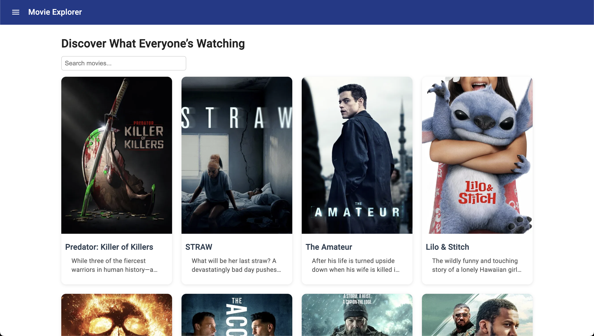
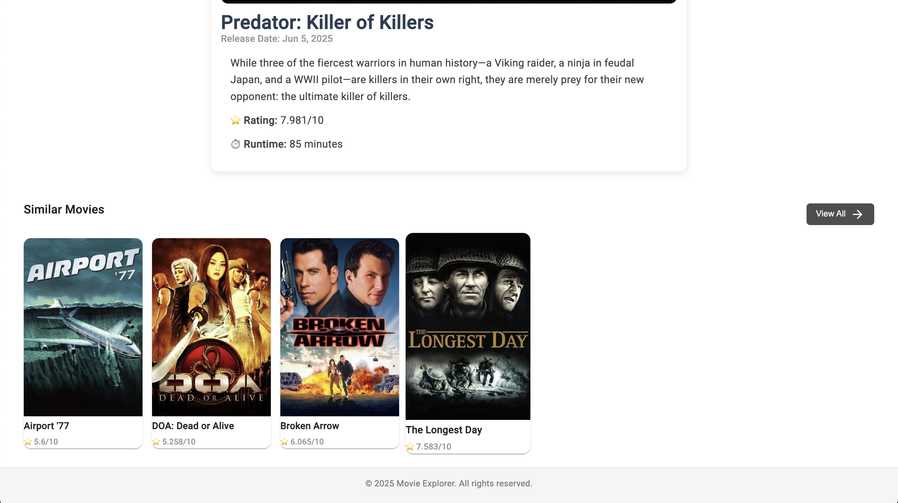
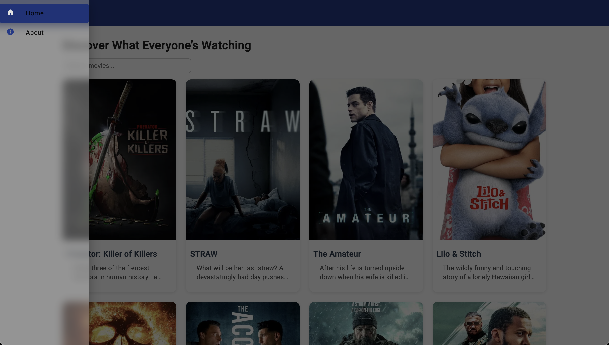
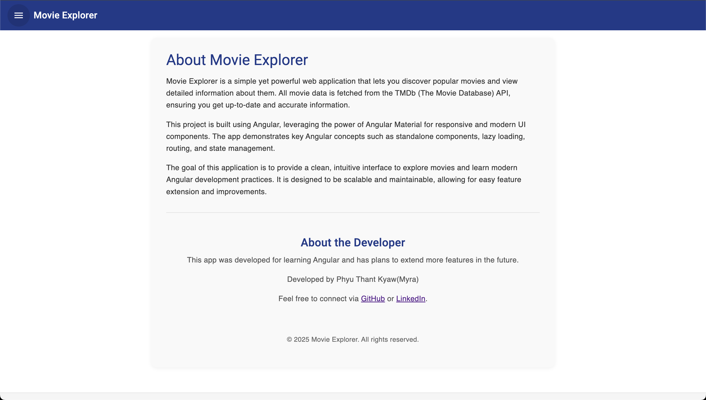

# 🎬 MovieBrowser

MovieBrowser is a responsive Angular web application that displays popular movies using The Movie Database (TMDb) API. Built with Angular 19, Angular Material, and a clean component-based architecture, it's designed as a showcase project for frontend development.






## 🔥 Features

- 📽️ Browse popular movies with titles, posters, and descriptions
- 🎨 Beautiful UI with Angular Material
- 🧭 Client-side routing with Angular Router
- 📦 Modular & service-based architecture
- 🔧 Service-based architecture using RxJS + HTTPClient

## 🛠️ Tech Stack

- [Angular 19.2.15](https://angular.io/)
- [Angular Material](https://material.angular.io/)
- [RxJS](https://rxjs.dev/)
- [TMDb API](https://www.themoviedb.org/documentation/api)

## 🚀 Live Demo

👉 [**Click here to view the live site**](https://your-demo-link.com)  
(will host on Vercel and replace this link.)

---

## 🧑‍💻 Getting Started

### Prerequisites

Make sure you have Node.js and Angular CLI installed:

```bash
npm install -g @angular/cli
```

## Environment Setup

Before running the app, create your own environment files:

```bash
cp src/environments/environment.sample.ts src/environments/environment.ts
```

## Run Locally
Clone the project:
```bash
git clone https://github.com/yourusername/movie-browser.git
cd movie-browser
npm install
ng serve
```

Once the server is running, open your browser and navigate to `http://localhost:4200/`. The application will automatically reload whenever you modify any of the source files.


## 📁 Project Structure
src/
├── app/
│   ├── layout/                    # Layout components
│   │   ├── header/                # Header component
│   │   │   └── header.component.ts / .html / .scss
│   │   ├── footer/                # Footer component
│   │   │   └── footer.component.ts / .html / .scss
│   │   ├── sidebar/               # Sidebar (sidenav)
│   │   │   └── sidebar.component.ts / .html / .scss
│   │   └── layout/                # Full layout component
│   │       └── layout.component.ts / .html / .scss
│   │
│   ├── pages/
│   │   ├── home/                  # Home page
│   │   └── movie-details/         # Movie detail page
│   │
│   ├── services/
│   │   └── movie.service.ts   # API service for TMDb
│   │
│   ├── app.routes.ts          # Angular routing config
│   └── app.config.ts       
│
├── assets/                    # Static files
├── environments/              # Environment settings (API key, etc.)
└── main.ts                    # App entry point

## ⚙️ Build for Production
```bash
ng build
```
The optimized build output will be available in the dist/ directory.

## 🧪 Testing
Run unit tests:

```bash
ng test
```

Run end-to-end tests (if configured):
```bash
ng e2e
```

## 📝 License
This project is for personal and educational purposes only.


## 👩‍💻 Author
Developed with ❤️ by Phyu Thant Kyaw(Myra)

“Developed to sharpen Angular skills and showcase a passion for UI design and clean code. More features coming soon!”
